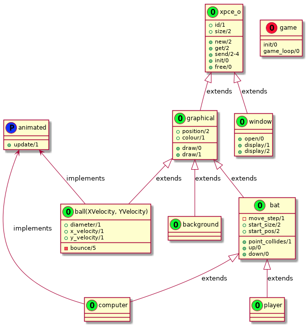

# PongTalk

This will be a Pong game written in Logtalk using XPCE for graphics and
thus is limited to the SWI-Prolog backend.

For now it's just a bouncing ball and paddles!

## How To Play

Load the program with:

```sh
swilgt -s loader.lgt
```

Then in the SWI-Prolog REPL call:

```prolog
game::play.
```

## Architecture


